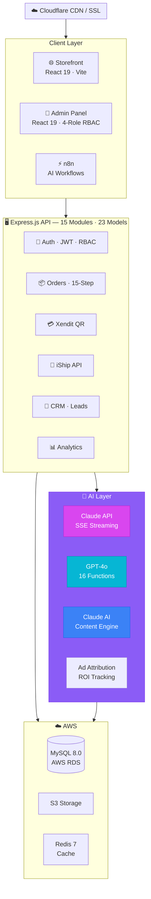
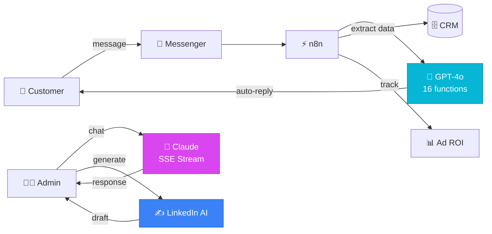
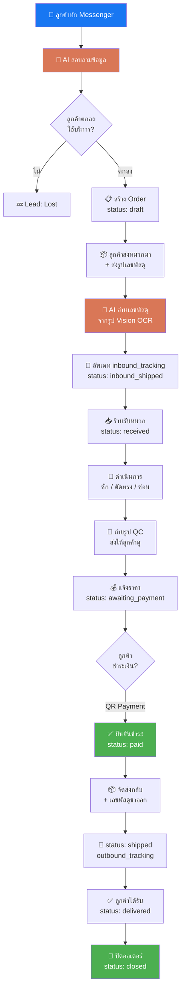

<div align="center">

# 🎩 HATZ — Hat Fix & Clean Platform

### AI-Powered E-Commerce & Operations Platform

**Solo-built.** Production-grade. Real AI in production — not demos.

[](https://hatfixclean.com)
[](https://admin.hatfixclean.com)
[](https://api.hatfixclean.com)

</div>

---

## 📸 Screenshots

| Admin Dashboard | AI Chat (Claude SSE) | Messenger Bot Flow |
|:---:|:---:|:---:|
|  |  |  |

| Order Lifecycle | Payment & Logistics | LinkedIn AI Engine |
|:---:|:---:|:---:|
|  |  |  |

---

## 🧠 Overview

A complete **production SaaS platform** for a hat cleaning business — handling everything from customer-facing e-commerce to internal operations, payments, logistics, and AI-powered automation.

**This is not a tutorial project.** It runs a real business with real customers, real payments, and real AI agents working 24/7.

> **One person. Four AI systems. Two platforms. Zero excuses.**

---

## 🤖 AI Systems — The Core Differentiator

> 90% of developers don't have this. This is the killer point.

### 1. 💬 Claude Admin Chat — SSE Streaming
Real-time AI assistant inside the admin dashboard. Streams responses instantly via Server-Sent Events.

```
Admin asks question → Claude API → SSE Stream → Real-time response
```

- Anthropic Claude API with conversation memory
- Server-Sent Events for instant streaming UX
- Used daily for operations support

### 2. 🤖 Messenger AI Bot — Claude Sonnet (Direct API, replaced n8n)
Fully automated customer support on Facebook Messenger. **Zero human intervention.**

```
Customer message → Facebook Webhook → n8n → GPT-4o (16 functions) → Auto-reply + CRM update
```

- OpenAI GPT-4o with **16 function calling tools**
- Auto-extracts: name, phone, address, service needed
- Creates leads & orders from conversation
- Context-aware responses with buffer memory

### 3. ✍️ LinkedIn AI Engine — Content Generation
AI-powered content system for personal branding. Generate → Edit → Post → Track.

```
Select topic → Claude generates draft → Review/Edit → Post to LinkedIn → Track performance
```

- 20-topic rotation, 4 writing styles
- Full post lifecycle management
- Performance tracking per post

### 4. 📊 Ad Attribution Intelligence
Automatic tracking: **Facebook Ad Click → Customer Conversion → Revenue**

```
Ad click → Messenger → Extract campaign/adset/ad → Link to customer → Calculate ROI
```

- Real ROI per ad campaign
- Campaign → Adset → Ad level tracking
- Revenue attribution per customer

---

## 🏗️ System Architecture



### AI Data Flow



---


## 📦 Order Lifecycle — End-to-End Flow

> ระบบติดตามออเดอร์ตั้งแต่ลูกค้าทักมาจนส่งหมวกกลับคืน — 15 สถานะ, tracking ตลอดเวลา



### 🔄 15-Step Order Status Flow

```
draft → awaiting_inbound_shipment → inbound_shipped → received
→ in_progress → washing → shaping → qc → completed
→ awaiting_payment → paid → ready_to_ship → shipped → delivered → closed
```

### 📊 What Gets Tracked

| ข้อมูล | รายละเอียด |
|---|---|
| **Inbound Tracking** | เลขพัสดุขาเข้า — ลูกค้าส่งหมวกมา |
| **Outbound Tracking** | เลขพัสดุขาออก — ร้านส่งหมวกกลับ |
| **Order Images** | รูป before/after/payment/shipment |
| **Status Logs** | บันทึกทุกการเปลี่ยนสถานะ + เวลา + ผู้เปลี่ยน |
| **Payment Status** | unpaid → partial → paid |
| **AI Conversations** | ประวัติแชททั้งหมดผูกกับ Order |

### 🤖 AI ช่วยอะไรใน Flow นี้

```
ลูกค้าทัก     →  AI สร้าง Lead อัตโนมัติ + สกัดข้อมูล (ชื่อ, จังหวัด, บริการ)
ส่งรูปพัสดุ   →  AI อ่านเลขพัสดุจากรูป (Claude Vision) + อัพเดท Order
ถามสถานะ      →  AI ดึงข้อมูล Order จาก DB + ตอบลูกค้าทันที
ถามราคา       →  AI ดึง Pricing Tiers จาก DB + คำนวณให้
```


---

## 🏪 Core Features

### E-Commerce & Orders
- 🛒 Public storefront with service catalog & pricing engine
- 📦 **15-step order lifecycle** (draft → payment → cleaning → QC → delivery)
- 💳 Webhook-based Xendit QR payments (idempotent processing)
- 🚚 Automated shipment creation & tracking (iShip API)
- 📸 S3 image upload for before/after photos

### Admin Dashboard (4-Role RBAC)
- 📊 Real-time analytics with Recharts
- 📋 Order management with WebSocket live updates
- 👥 Customer CRM with Messenger integration
- 💰 Revenue reports & ad attribution
- 🤖 AI Chat, LinkedIn AI, Automation monitoring

---

## 🛠️ Tech Stack

| Layer | Technology |
|:--|:--|
| **Frontend** | React 19, Vite, Tailwind CSS, Zustand, React Query |
| **Backend** | Node.js, Express.js, Sequelize ORM, Zod |
| **Database** | AWS RDS MySQL 8.0, Redis 7 |
| **AI** | Claude API (SSE), OpenAI GPT-4o (16 function calls), n8n AI agents |
| **Payments** | Xendit QR Gateway (webhook) |
| **Logistics** | iShip API |
| **Infra** | AWS EC2 + RDS + S3, Docker, Nginx, PM2, Cloudflare |

---

## 🚀 Quick Start

```bash
# Infrastructure
docker-compose up -d          # MySQL + Redis + n8n

# Backend
cd backend && cp .env.example .env && npm install
npm run sync-db && npm run dev   # → port 4000

# Frontend
cd frontend && npm install && npm run dev    # → port 3000

# Admin
cd admin && npm install && npm run dev       # → port 3001
```

---

## 📁 Project Structure

```
hatfixclean/
├── frontend/          → Public storefront (React 19)
├── admin/             → Backoffice dashboard (React 19, RBAC)
├── backend/src/modules/
│   ├── ai-chat/       → Claude SSE streaming
│   ├── linkedin-post/ → AI content engine
│   ├── webhooks/      → Messenger + payment webhooks
│   ├── orders/        → 15-step order lifecycle
│   ├── payments/      → Xendit QR processing
│   ├── shipments/     → iShip logistics
│   ├── leads/         → Lead + ad attribution
│   ├── customers/     → CRM
│   └── ... 15 modules total
├── automation/        → n8n workflows & AI configs
└── docker-compose.yml
```

---

## 💡 Key Takeaways

- ✅ **Production system**, not a prototype — serves real customers daily
- ✅ **4 AI systems** integrated into actual business operations
- ✅ **Full ownership** — every architecture decision, every deployment, one person
- ✅ **Real payments**, real logistics, real data — not mock APIs
- ✅ **Scalable infrastructure** — 99.9% uptime on AWS

---

## 👤 Author

**Chanan Preecha (Mai)** — Solo developer & system builder

I'm particularly interested in working as an early technical member to help build and scale products with real impact.

[](https://www.linkedin.com/in/chanan-preecha-898750278/)
[](mailto:chanan.pr1145x@gmail.com)
